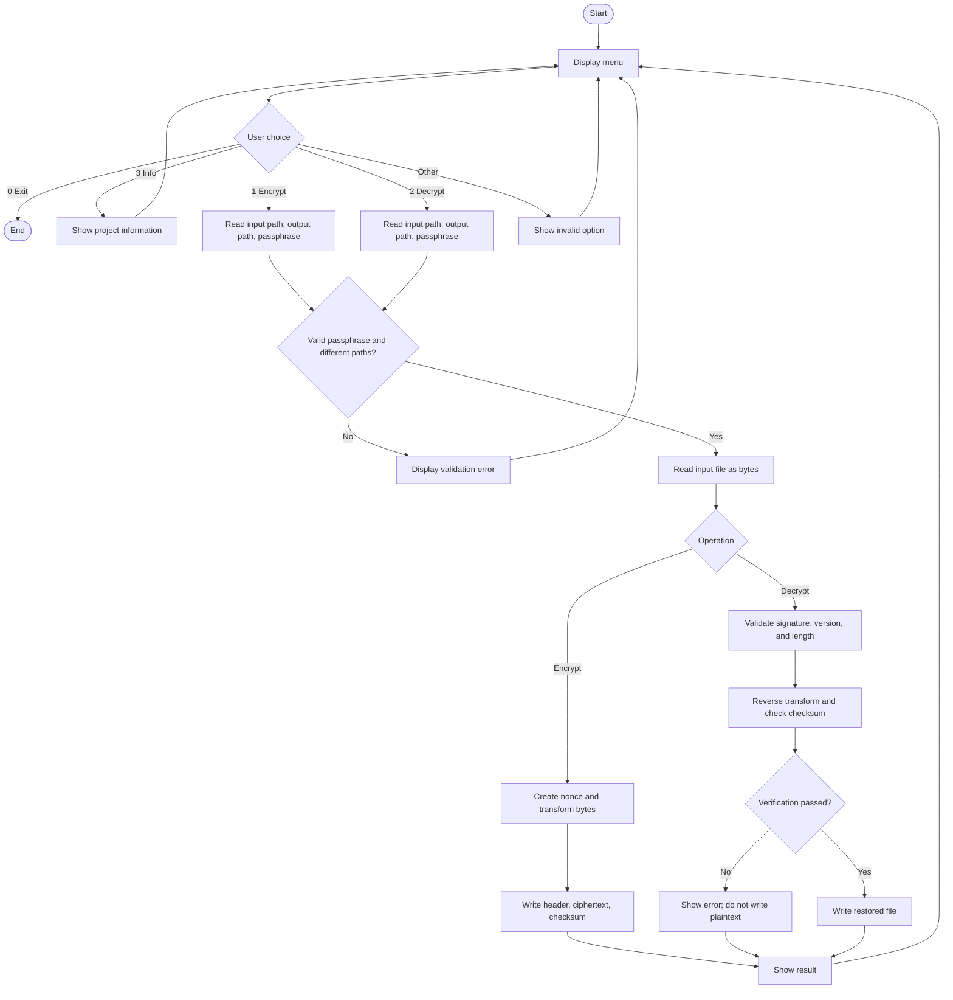

# Flowchart

```mermaid
flowchart TD
    A([Start]) --> B[Display menu]
    B --> C{User choice}
    C -->|0 Exit| Z([End])
    C -->|3 Info| I[Show project information]
    I --> B
    C -->|1 Encrypt| E[Read input path, output path, passphrase]
    C -->|2 Decrypt| D[Read input path, output path, passphrase]
    C -->|Other| X[Show invalid option]
    X --> B
    E --> V{Valid passphrase and different paths?}
    D --> V
    V -->|No| ER[Display validation error]
    ER --> B
    V -->|Yes| F[Read input file as bytes]
    F --> G{Operation}
    G -->|Encrypt| H[Create nonce and transform bytes]
    H --> J[Write header, ciphertext, checksum]
    G -->|Decrypt| K[Validate signature, version, and length]
    K --> L[Reverse transform and check checksum]
    L --> M{Verification passed?}
    M -->|No| N[Show error; do not write plaintext]
    M -->|Yes| O[Write restored file]
    J --> P[Show result]
    N --> P
    O --> P
    P --> B
```
